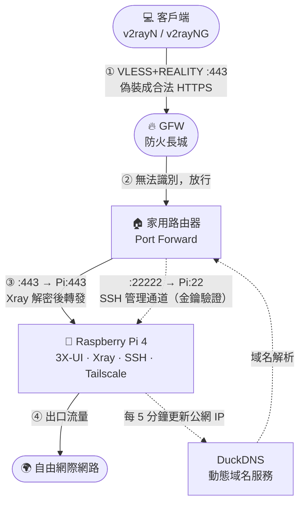
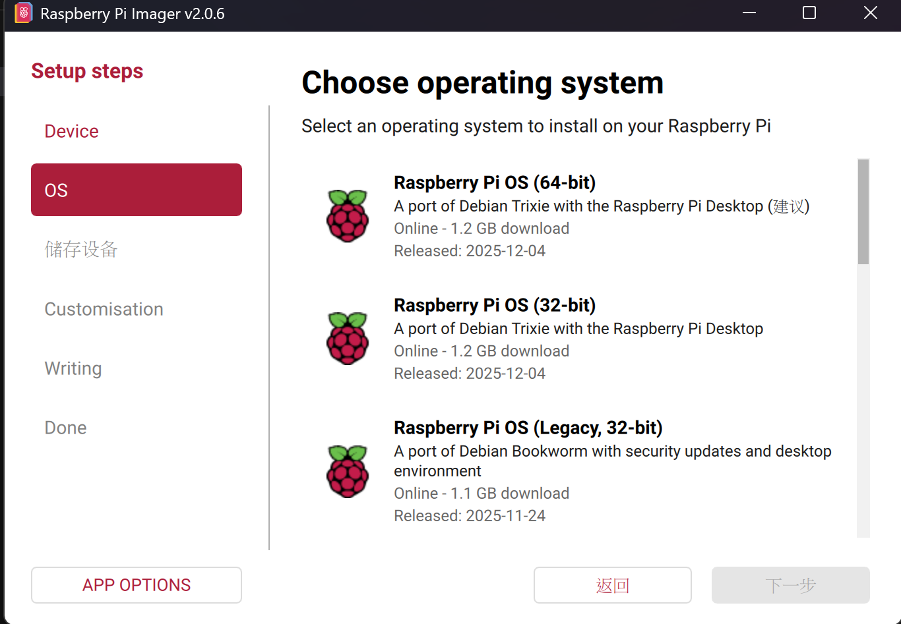
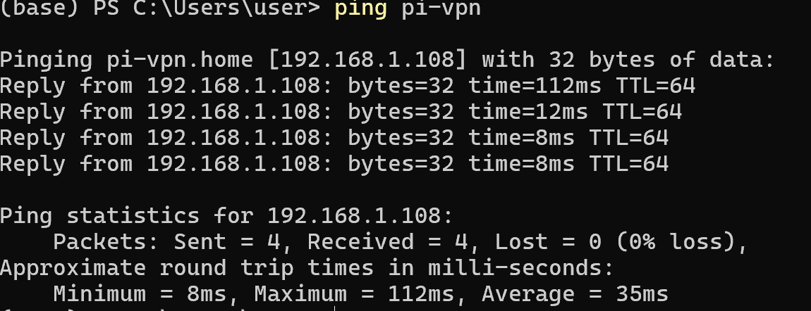
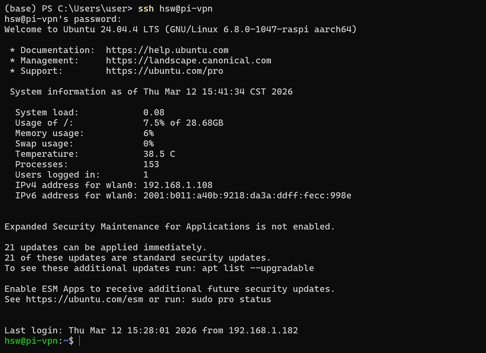
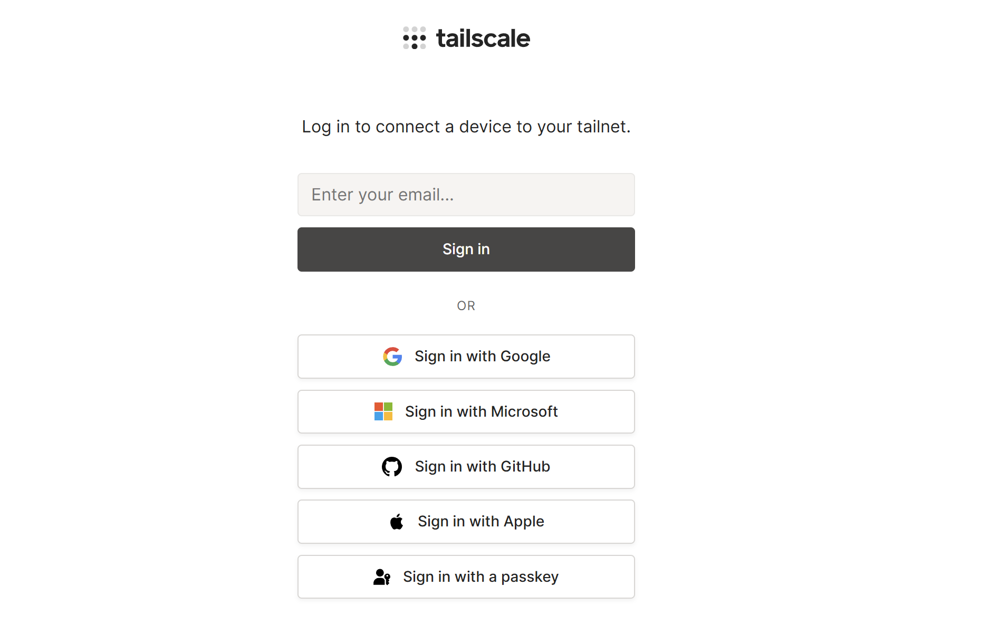
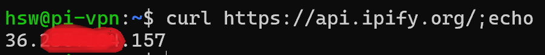
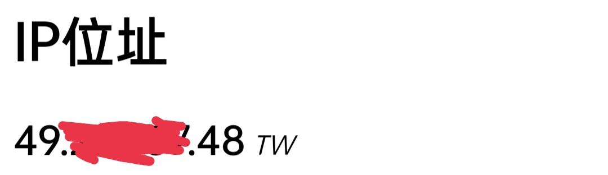
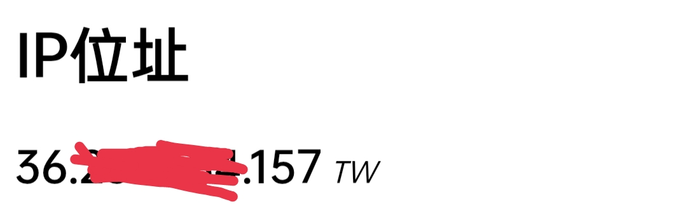
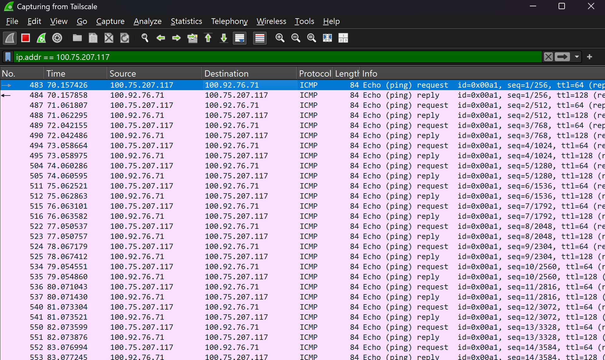
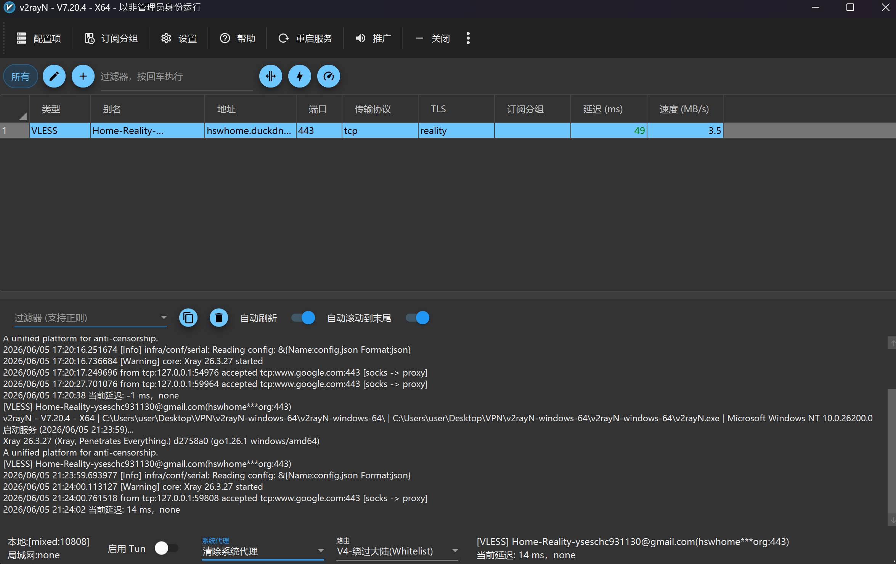

<div align="center">

# 使用 Raspberry Pi 4 海外自建VPN

> 這裡**硬體**以**家用樹莓派 4** 作為出口節點
>
> (其實**不一定要侷限於樹梅派**,任何可以上網且有CPU的硬體都可以拿來跑,比方說家裡不用的舊電腦、MAC...)
>
> 部署目前對 GFW 隱蔽性最高的 **VLESS + REALITY** 翻牆代理，
> 並搭配 **Tailscale** Mesh VPN、SSH 金鑰加固、DuckDNS 動態域名的完整工程實踐紀錄。
> 
>
> **適合族群：**
> - 海外華人（在美、歐、澳等地有家用寬頻，想把家裡的出口 IP 作為私人節點）或是有海外VPS用戶
> - 有需要翻牆的用戶，且對「把流量交給陌生 VPS / 機場」感到不安
> - 想自建節點、擺脫商業機場的工程師與技術愛好者
> - 對家用網路安全架構、GFW 對抗技術有研究興趣的人

</div>

---

## 目錄

- [為什麼不用商業 VPN？](#為什麼不用商業-vpn)
- [整體架構拓撲](#整體架構拓撲)
- [準備清單](#準備清單)
- [架設步驟](#架設步驟)
  - [1. 燒錄 OS 至樹莓派](#1-燒錄-os-至樹莓派)
  - [2. 簡易版：Tailscale Mesh VPN 部署](#2-簡易版tailscale-mesh-vpn-部署)
  - [3. 進階版：Xray + REALITY 高隱蔽代理](#3-進階版xray--reality-高隱蔽代理)
  - [4. 多節點備援：Cloudflare CDN 保護出口 IP](#4-多節點備援cloudflare-cdn-保護出口-ip)
- [安全加固](#安全加固)
  - [SSH 金鑰認證 + 關閉密碼登入](#ssh-金鑰認證--關閉密碼登入)
  - [路由器端口映射（外部 22222 → 內部 22）](#路由器端口映射外部-22222--內部-22)
  - [隱藏 X-UI 面板公網端口](#隱藏-x-ui-面板公網端口)
  - [DuckDNS 動態域名綁定](#duckdns-動態域名綁定)
- [效能優化](#效能優化)
  - [開啟 BBR 擁塞控制](#開啟-bbr-擁塞控制)
- [自動化腳本](#自動化腳本)
- [客戶端使用指南](#客戶端使用指南)
- [常見問題排除](#常見問題排除)
- [附錄：名詞解釋](#附錄名詞解釋)
- [免責聲明](#免責聲明)

---

## 為什麼不用商業 VPN？

| 比較項目 | 商業 VPN / 機場 | 本方案（自建） |
|---|---|---|
| 隱私風險 | VPS 提供商可能紀錄或出售流量 | 流量只經過自家設備 |
| IP 被封風險 | 多人共用，IP 特徵值高，容易被 GFW 標記 | 家用住宅 IP，極低特徵值 |
| 成本 | 月費 $5–$30 USD，機場可能跑路 | 一次性硬體費用，電費極低 |
| 協議隱蔽性 | 多數使用較舊協議 | VLESS + REALITY（目前最難被識別）|
| 自主控制 | 完全依賴第三方 | 完全自主，隨時可調整配置 |

---

## 整體架構拓撲



**流量路徑一覽：**

| 用途 | 完整路徑 |
|---|---|
| 翻牆 | 客戶端 `①` → GFW 放行 `②` → 路由器 :443 `③` → Xray REALITY `④` → 目標網站 |
| 遠端管理 | SSH Client → 路由器 :22222 → Pi :22（金鑰驗證） |
| X-UI 面板 | SSH Tunnel 本地轉發，面板不對公網直接開放 |

---

## 準備清單

### 硬體

| 項目 | 規格 | 備註 |
|---|---|---|
| 主機 | Raspberry Pi 4（建議 4GB RAM） | 主要計算節點 |
| 儲存 | microSD 卡 32GB，Class 10 以上(至少要能給你的樹梅派用) | 系統碟 |
| 讀卡機 | microSD → USB / SD | 燒錄用，一次性使用 |
| 路由器 | 支援 Port Forwarding 的家用路由器 | 本文使用 ZyXEL PMG4506-T20B |
| 管理電腦 | Windows / macOS / Linux 皆可 | 燒錄與 SSH 管理 |

### 軟體 / 帳號

- [Raspberry Pi Imager](https://www.raspberrypi.com/software/) — OS 燒錄工具
- [Tailscale 帳號](https://tailscale.com/) — 免費方案即可
- [DuckDNS 帳號](https://www.duckdns.org/) — 免費動態 DNS

---

## 架設步驟

### 1. 燒錄 OS 至樹莓派

#### 1.1 下載並安裝 Raspberry Pi Imager

前往 [raspberrypi.com/software](https://www.raspberrypi.com/software/) 下載對應平台的版本。

#### 1.2 燒錄設定

啟動 Imager，插入 microSD 卡後依序選擇：

- **設備**：Raspberry Pi 4
- **OS**：Ubuntu Server 24.04.x LTS (64-bit)
- **儲存媒體**：你的 SD 卡

點擊齒輪圖示 ⚙ 展開進階設定：

| 設定項目 | 建議值 | 說明 |
|---|---|---|
| Hostname | `pi-vpn` | 區網內可直接用此名稱 ping 到，免查 IP |
| Username | `YOUR_USERNAME` | 避免使用預設 `pi`，降低自動攻擊命中率 |
| Password | 強密碼 | 後續會改為金鑰驗證，這是暫時用 |
| Enable SSH | ✅ | 遠端管理必開 |
| Wi-Fi（選填） | SSID / 密碼 | 有線網路更穩定，建議優先用網線 |

按 **Write** 開始燒錄，完成後插入樹莓派並接電開機。



#### 1.3 確認連通性

```bash
ping pi-vpn
```



```bash
ssh YOUR_USERNAME@pi-vpn
```



#### 1.4 安裝基礎工具

```bash
sudo apt update && sudo apt upgrade -y
sudo apt install git vim curl wget -y
```

---

### 2. 簡易版：Tailscale Mesh VPN 部署

> **Tailscale** 是基於 WireGuard 的 Mesh VPN，支援 NAT Traversal 自動打洞，無需設定 Port Forwarding 即可讓設備跨網路互連。
>
> **限制**：WireGuard 特徵明顯，可能被 GFW 識別封鎖，適合作為管理通道而非主力翻牆使用。

#### 2.1 安裝 Tailscale

```bash
curl -fsSL https://tailscale.com/install.sh | sh
```

#### 2.2 加入你的虛擬網路

```bash
sudo tailscale up
# 終端會輸出一個登入 URL，用瀏覽器開啟並以 Google / GitHub 帳號登入即可
```



#### 2.3 開啟 IP 轉發（出口節點必要條件）

```bash
echo 'net.ipv4.ip_forward = 1' | sudo tee -a /etc/sysctl.conf
echo 'net.ipv6.conf.all.forwarding = 1' | sudo tee -a /etc/sysctl.conf
sudo sysctl -p
```

（選填）優化 UDP GRO 轉發效能：

```bash
sudo ethtool -K eth0 rx-udp-gro-forwarding on rx-gro-list off
```

#### 2.4 啟動為出口節點

```bash
sudo tailscale up --advertise-exit-node
```

進入 [Tailscale 管理後台](https://login.tailscale.com/admin/machines) → 找到 Pi → **Edit route settings** → 勾選 **Use as exit node**。

#### 2.5 驗證

```bash
# 在樹莓派上查詢公網 IP
curl https://api.ipify.org/
```



| 連接 Tailscale 前 | 連接 Tailscale 後 |
|:---:|:---:|
|  |  |

#### 2.6 Tailscale 常用指令

```bash
tailscale status                               # 查看所有節點狀態
tailscale ping <裝置名或 Tailscale IP>         # 測試與節點的延遲
tailscale file cp <檔案路徑> <裝置名>:         # 免帳密直接傳檔（替代 scp）
sudo tailscale down                            # 斷開 VPN 隧道（服務程序保留）
sudo systemctl stop tailscaled                 # 完全停止 Tailscale 服務
sudo tailscale up --advertise-exit-node        # 重新啟用出口節點
sudo tailscale up --advertise-exit-node=false  # 關閉出口節點功能
```

> **注意**：Tailscale MagicDNS 預設沿用上次連接的 DNS 紀錄，區網與 Tailscale 環境切換時若 Hostname 解析失敗，改用 `100.x.x.x` IP 直接連線即可。

#### 2.7 Mesh 網路封包驗證（WireShark）



---

### 3. 進階版：Xray + REALITY 高隱蔽代理

> **選擇 REALITY 協議的核心原因：**
> - 不需要域名或 SSL 憑證，直接借用真實網站的合法 TLS 憑證
> - GFW 主動探測時，REALITY 將請求轉發至真實目標站，GFW 看到完全合法的 TLS 握手
> - 只有持有正確私鑰的客戶端才能建立加密通道
> - Xray 核心在 Raspberry Pi 4 上運行輕量穩定

#### 3.1 安裝 3X-UI 管理面板

```bash
sudo su
bash <(curl -Ls https://raw.githubusercontent.com/MHSanaei/3x-ui/master/install.sh)
```

官方倉庫：[MHSanaei/3x-ui](https://github.com/MHSanaei/3x-ui)

#### 3.2 路由器設定

**固定樹莓派內網 IP（Static DHCP）**

進入路由器管理後台 → 網路設定 → LAN Setting → Static DHCP，填入 MAC Address 與欲固定的 IP。

```bash
# 在樹莓派上查詢 MAC Address
ip link show eth0
```

**設定 Port Forwarding**

| 規則名稱 | 外部端口 | 內部 IP | 內部端口 | 協議 |
|---|---|---|---|---|
| Xray-REALITY | 443 | YOUR_PI_LOCAL_IP | 443 | TCP |
| SSH-管理通道 | 22222 | YOUR_PI_LOCAL_IP | 22 | TCP |

> 外部 22222 對應 Pi 內部 SSH 端口 22；使用非標準外部端口可大幅降低自動掃描攻擊頻率。

#### 3.3 在 X-UI 介面建立入站規則

瀏覽器前往：`http://YOUR_PI_LOCAL_IP:2053/YOUR_PANEL_PATH/`

左側選單 → **入站列表** → **新增入站**，填入：

| 欄位 | 值 |
|---|---|
| 協議 | vless |
| 端口 | 443 |
| 傳輸 | TCP |
| 安全 | Reality |
| uTLS | chrome（模擬 Chrome TLS 指紋）|
| Target | `www.yahoo.com:443` |
| SNI | `www.yahoo.com` |

點擊 **Get New Cert** 生成公私鑰對，再點擊 **建立**。

#### 3.4 客戶端安裝

**Android（v2rayNG）**

前往 [v2rayNG Releases](https://github.com/2dust/v2rayNG/releases)，下載 `arm64-v8a.apk`。掃描 X-UI 面板 QR Code 匯入節點。

> ⚠️ QR Code 可能預設含內網 IP，需手動修改為公網 IP 或 DuckDNS 域名。

**Windows（v2rayN）**

前往 [v2rayN Releases](https://github.com/2dust/v2rayN/releases) 下載並解壓縮，複製 `vless://` 連結匯入節點。

---

### 4. 多節點備援：Cloudflare CDN 保護出口 IP

> **動機**：DuckDNS 只是單純的動態 DNS，域名查詢結果就是你家的真實公網 IP，等於把出口 IP 主動公告出去。一旦這個 IP 被 GFW 標記封鎖，整個代理就失效，得等 ISP 換發新 IP 才能恢復。
>
> **解法**：改用 Cloudflare 的免費 CDN（橘色雲朵代理），讓域名解析出來的是 Cloudflare 的 IP，真實家用 IP 完全不對外暴露。搭配原本的 REALITY 節點，形成「平時走 REALITY 直連（速度快），家用 IP 被封時切換至 CDN 節點（走 Cloudflare 邊緣網路）」的雙層備援。
>
> 這一步**不是取代** REALITY，而是多加一條命：REALITY 節點（3.3）繼續開著，Cloudflare CDN 節點是額外的逃生通道。

#### 4.1 購買網域並設定 Cloudflare DDNS

1. 在 [Cloudflare](https://dash.cloudflare.com/) 購買一個域名（例如 `example.com`），並將其 Nameserver 指向 Cloudflare。
2. 到 **My Profile → API Tokens** 建立一個 Token，權限選 **Edit zone DNS**，Zone Resources 限定你的域名。
3. 樹莓派安裝 [ddclient](https://github.com/ddclient/ddclient)，設定自動把公網 IP 更新進 Cloudflare DNS：

```bash
sudo apt install ddclient -y
```

`/etc/ddclient.conf`：

```
daemon=300
syslog=yes
protocol=cloudflare
use=web
zone=example.com
login=token
password=YOUR_CLOUDFLARE_API_TOKEN
www.example.com
```

```bash
sudo systemctl restart ddclient
sudo systemctl status ddclient
# 看到 SUCCESS: updating www.example.com: IPv4 address set to x.x.x.x 即代表成功
```

> ⚠️ `ddclient.conf` 含有 API Token，權限務必是 `600`（ddclient 啟動時會自動修正，但建議手動確認）。

#### 4.2 子域名分流：直連節點 vs CDN 節點

同一個網域下，用兩條不同的 DNS 記錄分別對應「直連」與「走 CDN」：

| DNS 記錄 | Proxy 狀態（雲朵顏色） | 用途 |
|---|---|---|
| `home.example.com` → 家用公網 IP | 🔘 灰色（僅 DNS，不代理） | 給 REALITY 節點用，REALITY 必須直連才能完成握手，不能經過 CDN |
| `www.example.com` → 家用公網 IP | 🟠 橘色（代理開啟） | 給 CDN 節點用，解析出來的是 Cloudflare 的 IP，隱藏真實家用 IP |

> REALITY 依賴偷取目標網站的真實 TLS 憑證做握手，Cloudflare 代理會終止/改寫 TLS，兩者無法共存於同一條走 CDN 的連線上。

#### 4.3 為 CDN 節點申請 SSL 憑證

CDN 節點用的是標準 TLS（不是 REALITY），需要一張真的憑證。若路由器沒有對外開放 80 port，走 HTTP-01 驗證會失敗（`connect: connection timed out`），改用 **DNS-01** 驗證：

```bash
curl https://get.acme.sh | sh
~/.acme.sh/acme.sh --issue --dns dns_cf -d www.example.com \
  --server letsencrypt
```

> `dns_cf` 需要 Cloudflare 的 **Global API Key**（不是前面 DDNS 用的 API Token），在 Cloudflare 個人資料頁取得，並設定環境變數 `CF_Key` / `CF_Email` 後再執行上述指令。

憑證簽發後複製到固定路徑，供 Xray 讀取：

```bash
sudo mkdir -p /root/cert/www.example.com
sudo cp ~/.acme.sh/www.example.com_ecc/fullchain.cer /root/cert/www.example.com/fullchain.pem
sudo cp ~/.acme.sh/www.example.com_ecc/www.example.com.key /root/cert/www.example.com/privkey.pem
sudo chmod 600 /root/cert/www.example.com/privkey.pem
```

Let's Encrypt 憑證效期 90 天，acme.sh 預設會裝 cron 自動續期。

#### 4.4 新增入站：VLESS + XHTTP + TLS + Cloudflare

在 X-UI 新增入站，注意 Xray 已**棄用 WebSocket**，官方建議一律改用 **XHTTP**（同時支援 HTTP/2 與 HTTP/3，效能更好且與 CDN 相容性佳）：

| 欄位 | 值 |
|---|---|
| 協議 | vless |
| 端口 | 2083（Cloudflare 支援代理的固定 HTTPS 端口之一，另有 443 / 2087 / 2096 / 8443） |
| 傳輸 | **xhttp** |
| Path | 自訂，例如 `/somepath` |
| 安全 | TLS |
| 憑證 | `/root/cert/www.example.com/fullchain.pem`、`privkey.pem` |

路由器 Port Forwarding 新增一條：外部 `2083` → Pi 內部 `2083`。

#### 4.5 Cloudflare SSL/TLS 模式：務必選 Full（Strict）

| 模式 | CF ↔ 你的伺服器 | 是否適用 |
|---|---|---|
| Flexible | CF 只會用 **HTTP:80** 連你的源站 | ❌ 你的 Xray 監聽的是 2083 且開了 TLS，Flexible 永遠連不到 |
| Full | CF 用 HTTPS 連源站的**同一個 port**，不驗證憑證真偽 | ✅ 可用 |
| Full (Strict) | 同上，且**要求憑證必須是受信任 CA 簽發** | ✅ **建議**，配合 4.3 的 Let's Encrypt 憑證使用 |

若模式與伺服器 TLS 設定不匹配，最常見的症狀是 **Error 525（SSL Handshake Failed）**。

#### 4.6 客戶端連結範例

```
vless://<UUID>@www.example.com:2083?encryption=none&security=tls&sni=www.example.com&type=xhttp&path=%2Fsomepath&host=www.example.com&mode=auto#CDN備援節點
```

> ⚠️ 若從 X-UI 面板直接匯出 QR Code / 連結，**位址欄位預設會是你當下登入面板所用的位址**（例如區網 IP `192.168.1.x`），且 `sni` 常常是空的。用網域跑 CDN 節點時，務必手動把 `address`、`host`、`sni` 三個欄位都改成你的網域，否則連得上 TCP 但 TLS/SNI 對不上，一樣無法使用。

#### 4.7 最終多節點架構

| 節點 | 傳輸 | 監聽 Port | 是否走 CDN | 用途 | `flow` |
|---|---|---|---|---|---|
| 節點1 | TCP + REALITY | 443 | 否，直連 | 主力，速度最快、隱蔽性最高 | `xtls-rprx-vision` |
| 節點2 | XHTTP + REALITY | 25045（非標準端口）| 否，直連 | 備援，非 443 較不易被針對性掃描，但也更容易被當成可疑端口 | 不設定 |
| 節點3 | XHTTP + TLS | 2083 | 是，經 Cloudflare | 家用 IP 被 GFW 封鎖時的最後備援 | 不設定 |

> `flow: xtls-rprx-vision` **只適用於「原始 TCP + REALITY/TLS」傳輸**，靠 XTLS 把內外層 TLS 封包拼接消除雙層 TLS 特徵。XHTTP 傳輸完全不支援 flow，設定了也不會生效，務必留空。

---

## 安全加固

### SSH 金鑰認證 + 關閉密碼登入

> 樹莓派一旦公網暴露，平均幾分鐘內就會出現自動化暴力破解攻擊。

**Step 1：在 Windows 客戶端生成 Ed25519 金鑰對**

```powershell
ssh-keygen -t ed25519 -C "my_windows_pc"
# 存於 C:\Users\YOUR_USERNAME\.ssh\
```

**Step 2：將公鑰上傳至樹莓派**

```powershell
type $env:USERPROFILE\.ssh\id_ed25519.pub | ssh YOUR_USERNAME@YOUR_PI_LOCAL_IP `
  "mkdir -p ~/.ssh && chmod 700 ~/.ssh && cat >> ~/.ssh/authorized_keys && chmod 600 ~/.ssh/authorized_keys"
```

> ⚠️ Windows 終端偶爾在公鑰開頭插入 BOM 字元，導致驗證失敗，若登入異常請手動寫入 `authorized_keys`。

**Step 3：關閉密碼驗證**

```bash
# 直接執行自動化腳本（推薦）
sudo bash scripts/setup_security.sh
```

腳本會同時修正 Ubuntu 24.04 的 `/etc/ssh/sshd_config.d/*.conf` 覆蓋設定問題。

手動方式（兩個檔案都要改）：

```bash
sudo nano /etc/ssh/sshd_config
# PasswordAuthentication no
# PubkeyAuthentication yes

sudo nano /etc/ssh/sshd_config.d/50-cloud-init.conf
# PasswordAuthentication no

sudo systemctl restart ssh
```

**Step 4：驗證**

```bash
ssh -o PubkeyAuthentication=no YOUR_USERNAME@YOUR_PI_LOCAL_IP
# 預期：Permission denied (publickey).
```

---

### 路由器端口映射（外部 22222 → 內部 22）

| 設計意圖 | 說明 |
|---|---|
| 外部 `:22222` → 內部 `:22` | 掃描工具優先掃描 22 端口，非標準外部端口可大幅降低暴露面 |
| 外部 `:443` → 內部 `:443` | Xray REALITY 流量，對外偽裝為正常 HTTPS |

從外部連入：

```bash
# 直接 SSH
ssh -p 22222 YOUR_USERNAME@your-domain.duckdns.org

# SSH Tunnel 存取 X-UI 面板（面板不對公網開放）
ssh -p 22222 -L 2053:localhost:2053 YOUR_USERNAME@your-domain.duckdns.org
# 瀏覽器開啟 http://localhost:2053/YOUR_PANEL_PATH/
```

---

### 隱藏 X-UI 面板公網端口

路由器的 Port Forwarding **只開放 443 和 22222**，2053 不對公網開放。即使攻擊者掃描公網 IP 也找不到面板入口，只能透過 SSH Tunnel（需要金鑰）才能存取。

---

### DuckDNS 動態域名綁定

> 家用 ISP 公網 IP 是動態分配的，路由器重啟後 IP 可能改變。DuckDNS 讓固定域名自動追蹤當前 IP。

1. 前往 [duckdns.org](https://www.duckdns.org/) 登入，新增子域名並記下 **Token**
2. 在腳本頂部填入 Domain 和 Token，執行：

```bash
nano scripts/duckdns_sync.sh   # 填入 DUCKDNS_DOMAIN 和 DUCKDNS_TOKEN
bash scripts/duckdns_sync.sh
```

3. 驗證 DNS 解析與公網 IP 一致：

```bash
nslookup your-domain.duckdns.org
curl https://api.ipify.org/
```

此後所有連線都改用域名：

```bash
ssh -p 22222 YOUR_USERNAME@your-domain.duckdns.org
```

---
## 效能優化
### 開啟 BBR 擁塞控制
* 傳統使用的為`Cubid`演算法, 遇到封包遺失就大幅降速(TCP加性增乘性減原理)
* BBR 是 Google 開發的新演算法，會主動偵測頻寬和延遲來控制速度，在高延遲、有封包遺失的環境表現明顯更好，VPN 速度會更穩定。

開啟 : 
```bash
echo "net.core.default_qdisc=fq" | sudo tee -a /etc/sysctl.conf
echo "net.ipv4.tcp_congestion_control=bbr" | sudo tee -a /etc/sysctl.conf
sudo sysctl -p
```

確認是否開啟
```bash
sysctl net.ipv4.tcp_congestion_control net.core.default_qdisc
```
輸出 :
> net.ipv4.tcp_congestion_control = bbr \
net.core.default_qdisc = fq

---
## 自動化腳本

| 腳本 | 功能 | 執行身分 |
|---|---|---|
| [`scripts/setup_security.sh`](scripts/setup_security.sh) | SSH 金鑰加固、關閉密碼登入、Ubuntu 24.04 雙設定檔修正 | sudo |
| [`scripts/duckdns_sync.sh`](scripts/duckdns_sync.sh) | 建立 DuckDNS 更新腳本並安裝 cron 任務 | 一般用戶 |

```bash
git clone https://github.com/YOUR_GITHUB_USERNAME/raspi-reality-homelab.git
cd raspi-reality-homelab

sudo bash scripts/setup_security.sh

nano scripts/duckdns_sync.sh   # 填入 Domain / Token
bash scripts/duckdns_sync.sh
```

---

## 客戶端使用指南

### v2rayN 介面說明（Windows）



#### 系統代理模式

| 模式 | 效果 | 使用場景 |
|---|---|---|
| 自動配置系統代理 | 接管 Windows 系統代理，瀏覽器自動跟隨 | **最常用**，日常翻牆 |
| 清除系統代理 | 關閉代理，恢復直連 | 下載大陸大檔案、測試原生網速 |
| 不改變系統代理 | 不干預系統代理設定 | 配合 SwitchyOmega 等擴充套件 |
| PAC 模式 | 透過 PAC 文件判斷哪些網址走代理 | 舊式方案，現已少用 |

#### 路由模式

| 模式 | 效果 | 使用場景 |
|---|---|---|
| 繞過大陸（Whitelist）| 大陸網站直連，境外網站走代理 | **在大陸時強烈推薦** |
| 全局（Global）| 所有流量走代理 | 確保所有請求來自台灣 IP |
| 黑名單（Blacklist）| 只有黑名單網址走代理 | 特殊場景 |

#### TUN 模式（整機代理）

建立虛擬網卡，強制接管整台電腦所有封包。**適用場景**：PowerShell / SSH 直連樹莓派、遊戲、Discord、Spotify 等不遵循系統代理的軟體需要翻牆。

#### 系統代理 vs TUN 模式的本質差異

| 比較項目 | 系統代理（HTTP Proxy） | TUN 模式（虛擬網卡） |
|---|---|---|
| 工作層級 | 應用層 L7 | 網路層 L3 |
| 覆蓋範圍 | 遵循系統代理設定的應用（主要是瀏覽器） | 整台電腦所有流量，無例外 |
| 協議支援 | HTTP / HTTPS / SOCKS5 | TCP + UDP + ICMP（全協議）|
| 無法覆蓋的場景 | curl、遊戲用戶端、部分 App | 幾乎沒有 |
| 效能損耗 | 低 | 略高 |

#### 日誌區常見訊息

```
accepted tcp:www.google.com:443 [socks -> proxy]   # ✅ 流量正常轉發
connection refused                                  # ❌ 家用 IP 可能已變，確認 DuckDNS 是否同步
timeout                                             # ❌ 443 被封，檢查 Port Forwarding
```

---

## 常見問題排除

### 問題一：TUN 模式出現 `context deadline exceeded`（路由迴圈）

**症狀**：開啟 TUN 模式後，v2rayN 日誌不斷出現 `context deadline exceeded`，網路完全斷開。

**根本原因**：

系統代理模式下，App 是「主動選擇」把請求丟給 v2ray 本地 port，v2ray 的出站流量不會被自己攔截，運作正常：

```
App 想連 Google
  ↓
App 把請求丟給 v2ray 本地 port（如 1080）
  ↓
v2ray 的 process 直接連到 YOUR_PI_PUBLIC_IP:443（走正常網卡）
  ↓
Pi → Google
```

TUN 模式則會接管整張路由表，導致 v2ray 的出站封包也被自己攔截，形成無限迴圈：

```
v2ray 想連 YOUR_PI_PUBLIC_IP:443
  ↓
封包進入 OS 網路層
  ↓
路由表：所有 IP 走 tun0（虛擬網卡）
  ↓
封包被 v2ray 自己讀到 → 「這要送去 YOUR_PI_PUBLIC_IP:443」→ 再送一次
  ↓
無限迴圈 → Context deadline exceeded
```

**解決方式**：在路由規則中為 VPN 伺服器加一條 `direct` 規則，讓 v2ray 的出站流量繞過 tun0：

v2rayN → **設定** → **路由規則設定** → 新增一條規則：

| 欄位 | 值 |
|---|---|
| 備註 | `bypass-vpn-server` |
| Domain | `your-domain.duckdns.org` |
| 出站 | `direct` |

儲存後重啟核心。加了此規則後：

```
v2ray 想連 your-domain.duckdns.org:443
  ↓
路由規則命中：direct → 走真實網卡，不進 tun0
  ↓
正常連線成功
```

---

### 問題二：未設定 `flow`，流量在 GFW 下特徵明顯

**症狀**：連線可用，但在大陸網路環境下容易被干擾或封鎖。

**根本原因**：

未設定 flow 時，連線 Google（HTTPS）的流量結構是 TLS 包著 TLS：

```
外層：VLESS + REALITY（TLS）
  └─ 內層：Google 的 HTTPS（也是 TLS）
```

正常瀏覽器不會產生雙層 TLS 結構，GFW 的深度包檢測從統計特徵就能識別這是代理流量。

`xtls-rprx-vision` 的解法是在 REALITY 握手完成後，直接將內層 TLS 原始封包「拼接」進去，消除雙層 TLS 特徵：

```
外層 REALITY 握手完成後
  ↓
內層 TLS 原始封包直接拼接（不再雙重封裝）
  ↓
GFW 看到的是：完整的 Yahoo TLS 握手 + 正常的 TLS 應用資料
  ↓
無法與真實 Yahoo 流量區分
```

**解決方式（Server 和 Client 必須同時設定）**：

#### Server 端（樹莓派）

直接用 sqlite3 更新資料庫設定，再重啟 x-ui：

```bash
sudo sqlite3 /etc/x-ui/x-ui.db \
  "UPDATE inbounds SET settings = json_set(settings, '$.clients[0].flow', 'xtls-rprx-vision') WHERE id = 1;"
sudo systemctl restart x-ui
```

#### Client 端

**手機（v2rayNG）**：長按伺服器設定 → 編輯 → 找到 **Flow** 欄位，填入 `xtls-rprx-vision` → 儲存

**電腦（v2rayN）**：伺服器列表雙擊編輯 → **流控** 欄位填入 `xtls-rprx-vision` → 儲存

#### 驗證是否生效

Flow 有個特性：Server 和 Client 必須同時設或同時不設，否則直接連不上。

1. Client 設好 `xtls-rprx-vision` 後，確認可以正常連線
2. 故意把 Client 的 flow 清空，測試連線
3. 清空後若連不上 → 代表 Server 確實在強制要求 flow，兩端均已生效

---

### 問題三：REALITY 的偽裝目標（Target）用大型 CDN 網站，握手間歇性失敗
> 不要用Microsoft

**症狀**：Server 端日誌（`x-ui log` 或 `journalctl -u x-ui`）出現大量：

```
REALITY: processed invalid connection from x.x.x.x:xxxx: handshake did not complete successfully
```

Client 明明帶著正確的 UUID / Public Key / Short ID，TCP 也連得上（`telnet` / TCPing 有回應），但就是連不上代理，且 `access.log` 完全沒有這個連線的紀錄（因為 REALITY 判定驗證失敗時，會直接把流量原樣轉發給偽裝目標，不會當作代理連線記錄）。

**根本原因**：

REALITY 的原理是伺服器主動連到 `target`（例如 `www.microsoft.com:443`）幫客戶端「偷」一份真實的 TLS 憑證。如果 `target` 是走 **Azure Front Door / 大型 Anycast CDN** 這類「同網域背後有一大群、且會依請求來源動態調度的邊緣伺服器」的網站，你的樹莓派每次連出去拿到的憑證/TLS Session 都可能落在不同台機器上，尤其手機用行動網路連進來時（電信商的出口路由本身就不穩定），伺服器端與客戶端兩邊對應到的「真實站點狀態」對不起來，就會讓 REALITY 的驗證邏輯判定為無效連線。

**解決方式**：把 `target` / `serverNames` 換成**單一來源、非大型 CDN** 的網站，社群回報較穩定的選擇例如 `addons.mozilla.org`。X-UI 入站編輯畫面裡的 REALITY 設定：

| 欄位 | 原本（不穩定） | 建議改成 |
|---|---|---|
| Dest / Target | `www.microsoft.com:443` | `addons.mozilla.org:443` |
| ServerNames | `www.microsoft.com` | `addons.mozilla.org` |

改完後，**Client 連結裡的 `sni` 也要一併同步修改**，否則兩邊仍然對不上。

---

### 問題四：在家用 Wi-Fi 下用「自己家裡的公網 IP」連自己的節點，完全連不上（NAT 迴環）

**症狀**：手機連著家裡 Wi-Fi，VPN 設定填的是家用公網 IP，TCPing 測試顯示逾時或連不上；但用線上工具從外部測試同一個 IP/Port 卻是通的。

**根本原因**：這是路由器對 **NAT Hairpin（NAT 迴環）** 支援不完整的典型症狀——同一台路由器底下的裝置，用「自己的公網 IP」回頭連接同樣在這台路由器底下的伺服器，很多消費級路由器不會正確處理這種「繞一圈回自己家」的封包。這不是 Port Forwarding 設定錯誤，外部連線完全不受影響。

**解決方式**：在家測試時**直接用手機行動數據**（關閉 Wi-Fi），脫離家用路由器的網路環境再測試；或者幫家用 IP 額外設一條 DNS Split（區網內解析成內網 IP，區網外才解析成公網 IP），但這需要自架 DNS，對一般家用環境來說直接用行動數據測試更省事。

---

### 問題五：3X-UI 大版本更新後，面板路徑與存取方式改變

**症狀**：執行 `sudo x-ui` → 選項 `2. Update` 更新面板後，原本的 `http://PI_IP:PORT/panel/xray` 網址打不開了。

**根本原因**：3X-UI 從 2.x 更新到 3.x 之後，若偵測不到可用的 SSL 憑證（例如路由器沒開放 80 port，Let's Encrypt 驗證失敗），會自動產生一組**隨機字串當作新的 Web Base Path**，取代原本固定的 `/panel/xray`，作為額外的安全機制（避免面板路徑被掃描猜到）。更新過程的輸出訊息會直接印出新路徑，例如：

```
New WebBasePath: JO8aoW24hSOsFPZoij
Access URL: https://YOUR_IP:2053/JO8aoW24hSOsFPZoij
```

**解決方式**：更新前先截圖/記錄目前設定；更新後改用輸出訊息裡給的新網址登入（若 SSL 憑證簽發失敗，只能用 `http://` 而非 `https://` 存取）。也可以用 `sudo x-ui settings` 隨時查詢目前的 Web Base Path。

---

### 問題六：X-UI 匯出的連結，位址欄位跟你當下登入面板的方式綁在一起

**症狀**：明明伺服器設定是網域（CDN 節點），用面板「產生 QR Code」功能匯出後掃到手機，連結裡的伺服器位址卻是內網 IP（如 `192.168.1.109`），而且 `sni` 是空的。

**根本原因**：X-UI 產生分享連結時，伺服器位址欄位預設抓的是**你瀏覽器目前用來存取面板的那個位址**，而不是你在入站設定裡填的憑證網域。如果你是用區網 IP 登入面板（例如透過 Tailscale 或區網直連），匯出的連結自然也會是那個區網 IP。

**解決方式**：CDN／網域類型的節點，匯出連結後**務必手動檢查並修正三個欄位**：`address`（伺服器位址）、`host`、`sni`，改成實際的網域名稱，才能讓 TLS SNI 正確送達 Cloudflare／伺服器。

---

## 附錄：名詞解釋

### GFW 的識別手段

| 技術 | 說明 |
|---|---|
| IP 封鎖 | 直接封鎖已知 VPN 服務的 IP 段 |
| DNS 汙染 | 將被封鎖域名解析至錯誤 IP |
| 深度包檢測（DPI）| 分析封包特徵，識別代理協議流量 |
| 主動探測 | 向可疑 IP 發送探測請求，判斷是否為代理伺服器 |
| 大數據 + ML | 統計流量行為模式，識別與正常 HTTPS 的統計差異 |

### 協議演進與隱蔽性對比

```
Shadowsocks → VMess → Trojan → VLess → REALITY
              隱蔽性逐步提升 ────────────────────▶
```

| 協議 | 核心技術 | 對 GFW 的隱蔽性 |
|---|---|---|
| Shadowsocks | 輕量級 SOCKS5 代理 + 對稱加密 | ❌ 已可被 DPI 識別 |
| VMess | UUID 驗證 + 時間戳機制 | ⚠️ 特徵逐漸被識別 |
| Trojan | 完整模仿 HTTPS，在 443 監聽 | ⚠️ 部分環境下被識別 |
| VLESS | VMess 輕量化，解耦加密與傳輸 | ✅ 需搭配 REALITY |
| **REALITY** | 借用真實域名 TLS 憑證，無法與正常 HTTPS 區分 | ✅ **目前最高隱蔽性** |
| Hysteria2 | 基於 QUIC / UDP，自帶類 BBR 壅塞控制 | ⚠️ 見下方評估 |

#### 關於 Hysteria2：值得加嗎？

Hysteria2 在高延遲、高丟包的線路上速度表現通常優於任何 TCP-based 方案，是很有吸引力的選項，但實際評估後**不建議作為主力**，只適合當「額外的備用方案」：

- **UDP 更容易被針對性限速／封鎖**：許多電信商（尤其行動網路）對 UDP 流量本身就有 QoS 限速或節流策略，跟 GFW 主動封鎖無關，日常使用就可能不穩定。
- **無法藏在免費 CDN 後面**：Cloudflare 免費方案的 CDN 代理只支援 TCP，UDP/QUIC 流量無法走「橘色雲朵」隱藏來源 IP，因此 Hysteria2 節點必然直接暴露家用 IP，等於重複了 REALITY 節點已有的曝險，卻少了 REALITY 那種「主動探測也測不出破綻」的偽裝能力。
- **好處是風險隔離**：GFW／電信商對不同 Port、不同協議是分開偵測的，就算 Hysteria2 節點被針對性封鎖，也不會連累同一台主機上的 REALITY 節點或 CDN 節點，頂多損失這一個備援選項。

結論：如果主要訴求是「在不穩定、高延遲的國際線路上榨出更快的速度」，值得一試；如果只是想多一層防封鎖備援，現有的 REALITY 直連 + Cloudflare CDN 兩層組合已經足夠，Hysteria2 不會帶來額外的抗封鎖效果。

### 系統代理 vs TUN 模式（原理）

**系統代理**：作業系統設定代理端口（如 `127.0.0.1:10809`），遵循此設定的應用程式將請求先發送給本地代理程式，再轉發至 VPN 節點。不遵循的程式（遊戲、curl、SSH）流量仍直連。

**TUN 模式**：在網路層建立虛擬網卡並修改路由表，讓所有封包強制進入虛擬網卡，任何應用程式、任何協議均無法繞過。

### 內核（Core）

| 內核 | 說明 |
|---|---|
| **Xray** | V2Ray 的高效能社群分支，支援 VLESS、VMess、Shadowsocks、Trojan、REALITY 等全協議 |
| sing-box | 新興統一代理平台，跨平台支援完善，生態持續成長中 |

<br/>

---

## 免責聲明

本倉庫內容僅為個人技術學習與隱私保護目的之工程實踐紀錄，供研究與參考使用。使用者須自行評估並遵守所在地區的相關法律法規，本人不對任何因使用本文內容而產生的法律責任負責。

---

<div align="center">

如果這個專案對你有幫助，歡迎點個 ⭐ Star！

有問題或改進建議，歡迎開 [Issue](../../issues) 討論。

</div>